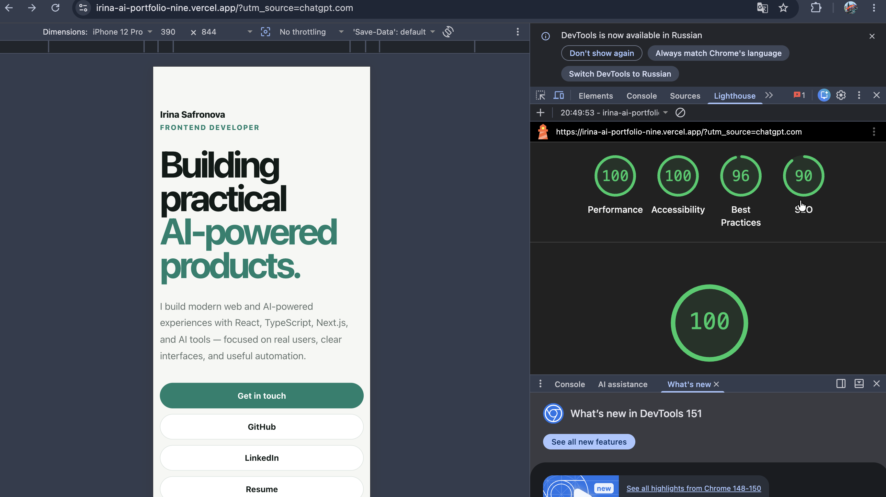
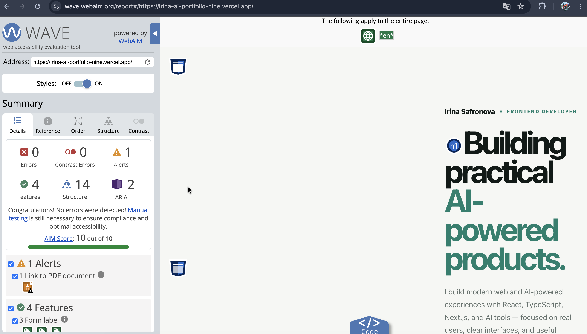

# Accessibility and Performance Audit

## Project

**Project:** Irina Safronova Portfolio  
**Live URL:** https://irina-ai-portfolio-nine.vercel.app/

This audit evaluates the deployed portfolio for accessibility, mobile performance, keyboard usability, and common web quality issues.

## Tools Used

- Chrome Lighthouse — Mobile
- WAVE Web Accessibility Evaluation Tool
- Keyboard-only navigation testing
- Manual review

## Lighthouse Baseline

The initial Lighthouse Mobile audit produced the following scores:

| Metric | Before |
|---|---:|
| Performance | 100 |
| Accessibility | 100 |
| Best Practices | 96 |
| SEO | 90 |

### Baseline Screenshot



## Issues Found

### Missing Meta Description

The initial SEO audit identified that the page did not contain a meta description.

The document metadata was updated with a descriptive page title and meta description that better explain the portfolio and its focus.

### WAVE Accessibility Audit

WAVE reported:

- 0 accessibility errors
- 0 contrast errors
- 1 alert
- AIM score: 10/10

The single WAVE alert was related to the Resume link pointing to a PDF document. This link is intentional and was reviewed rather than treated as an accessibility failure.

### WAVE Evidence



## Keyboard-Only Testing

The primary portfolio flow was manually tested without using a mouse.

The following interactions were verified:

- Tab navigation moves through interactive elements.
- Shift+Tab allows reverse navigation.
- Links and buttons can be reached using the keyboard.
- Enter activates links and controls correctly.
- Keyboard focus is visibly indicated.
- Contact form controls can be reached using the keyboard.
- The main portfolio flow can be completed without a mouse.

**Result:** PASS

## Accessibility Improvements

Accessibility and usability improvements include:

- Visible `:focus-visible` styles for keyboard users.
- Improved mobile typography and spacing.
- Comfortable interactive control sizes on small screens.
- Improved contact-form readability on mobile.
- `prefers-reduced-motion` support to reduce animations for users who request reduced motion.

Example:

```css
@media (prefers-reduced-motion: reduce) {
  html {
    scroll-behavior: auto;
  }

  *,
  *::before,
  *::after {
    scroll-behavior: auto !important;
    transition-duration: 0.01ms !important;
    animation-duration: 0.01ms !important;
    animation-iteration-count: 1 !important;
  }
}